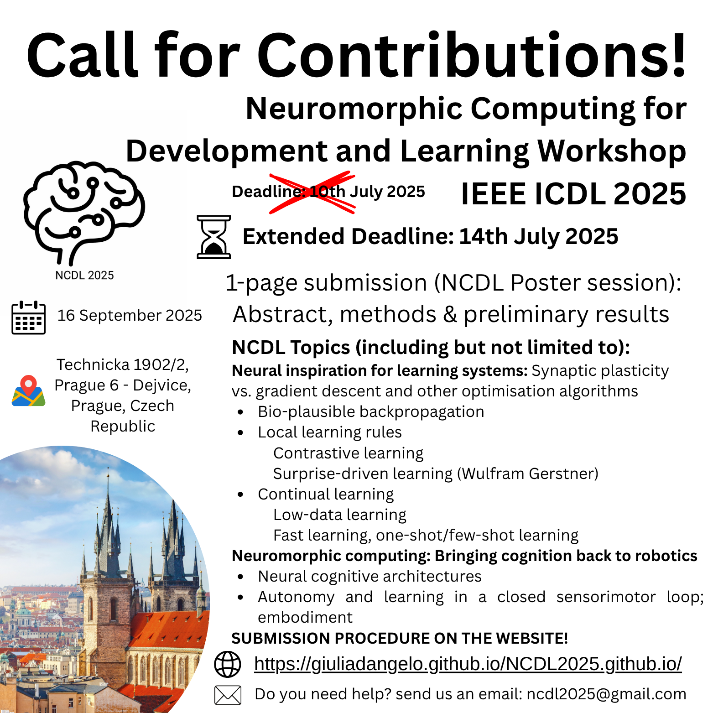

# Neuromorphic Computing for Development and Learning Workshop (NCDL)

**International Conference on Development and Learning (ICDL)**  
📅 **Full-Day Workshop, 16 September 2025**  
📍 **Faculty of Electrical Engineering CVUT, Prague, Czech Republic**

🌐 [**Visit the official website**](https://giuliadangelo.github.io/NCDL2025.github.io/)

---

## Submission Deadline: **10 July 2025**
[Submission procedure here](#-submit-a-new-contribution-to-the-ncdl-2025-community-on-zenodo)

---

## 🧑‍🔬 Organizers

- **Dr. Giulia D'Angelo** – Czech Technical University in Prague  
- **Dr. Alexander Hadjiivanov** – Adapsent, Leiden, Netherlands  
- **Matthias Kampa** – Zurich University of Applied Sciences  
- **Dr. James Knight** – University of Sussex  
- **Prof. Yulia Sandamirskaya** – Zurich University of Applied Sciences  

## 🧑‍🎓 Assistants

- **Olha Vedmedenko** – Bachelor student, CTU
- **Lukáš Bartůněk** – Master student, CTU

---

## 🧠 About the Workshop

The Neuromorphic Computing for Development and Learning Workshop is a full-day event uniting experts from academia and industry to explore advances in neuromorphic computing and developmental learning. The workshop focuses on brain-inspired sensing and computing, particularly spiking neural networks (SNNs), which enable efficient, adaptive, real-time processing. Topics include event-driven sensing, visual navigation, spike-based and contrastive learning, and neuromorphic architectures, highlighting their role in sensorimotor and cognitive development. Keynotes, poster sessions, and industry demos will showcase applications in robotics and sensory technologies, emphasizing perception, attention, and decision-making. Hands-on tutorials will offer practical experience in selective attention, perception, and embodied learning. The day concludes with a synthesis of insights and future research directions.

---

## 🎤 Keynote Speakers

- **Dr. Arren Glover** – Technologist at IIT, Italy. Expert in Event-Driven Perception
- **Prof. Thomas Nowotny** – Professor of Informatics at University of Sussex, UK. Expert in SNN Training
- **Dr. Chiara De Luca** – Senior Researcher at Digital Society Initiative, Zurich, Switzerland
- **Dr. Arthur Aubret** – Senior Researcher at Frankfurt Institute for Advanced Studies, Germany
- **Dr. Luca Peres** – Lecturer specialized in neuromorphic computing at University of Manchester, UK
- **Dr. Srikanth Ramaswamy** – Academic Track Fellow, Newcastle University, UK
- **Dr. Katarzyna (Kasia) Kożdoń** – Strategic Business Development & Solutions Manager, Innatera, Netherlands
- **Dr. Thomas Ortner** – IBM neuroinspired AI, IBM Zurich

---

## 📖 Content

Traditional AI struggles with real-time adaptability, continual learning, and energy efficiency. Neuromorphic computing addresses these challenges through event-driven architectures and spiking neural networks (SNNs), enabling low-power, real-time processing ideal for robotics and smart sensors. By mimicking biological systems, neuromorphic models process only relevant environmental changes, reducing data load and supporting adaptive, context-aware behavior. SNNs add mechanisms like synaptic plasticity and temporal coding for experience-driven learning. Aligned with the goals of the International Conference on Development and Learning (ICDL), this workshop explores how neuromorphic principles support lifelong, embodied learning in autonomous agents. Topics include contrastive learning, continual adaptation, and the role of embodiment in cognitive systems. The program features both theoretical discussions and hands-on sessions on neuromorphic perception, navigation, and sensorimotor integration, fostering collaboration across neuroscience, robotics, psychology, and AI.

---

## 📌 NCDL Topics (Not Limited To)

- **Neural inspiration for learning systems: Synaptic plasticity vs. gradient descent and other optimization algorithms**
  - Bio-plausible backpropagation
  - Local learning rules
    - Contrastive learning
    - Surprise-driven learning (Wulfram Gerstner)
- **Continual learning**
  - Low-data learning
  - Fast learning, one-shot/few-shot learning
- **Neuromorphic computing: Bringing cognition back to robotics**
  - Neural cognitive architectures
  - Autonomy and learning in a closed sensorimotor loop; Embodiment

---

## 🗓️ Workshop Schedule

| Time        | Session                                                                                                                                  |
|-------------|------------------------------------------------------------------------------------------------------------------------------------------|
| 08:50–09:00 | Dr. Giulia D'Angelo - Welcome and intro to the workshop                                                                                  |
| 09:00–09:30 | Keynote: Dr. Arren Glover (confirmed - in person) - Robot Perception with Bio-inspired Event Cameras + Q&A                               |
| 09:30–10:00 | Keynote: Prof. Thomas Nowotny (confirmed - in person) - How to efficiently train Spiking Neural Networks on machine learning tasks + Q&A |
| 10:00–10:30 | Keynote: Dr. Chiara De Luca (confirmed - in person) - Learning on the edge: local and online neuromorphic intelligence + Q&A                                                                            |
| 10:30–11:00 | Coffee Break + Intro Poster Session                                                                                                      |
| 11:00–11:30 | Keynote: Dr. Arthur Aubret (confirmed - in person) - Bio-inspired Self-Supervised Learning of Visual Object Representations + Q&A        |
| 11:30–12:00 | Keynote: Dr. Luca Peres (confirmed - in person) - Events are all you need + Q&A                                                 |
| 12:00–12:30 | Keynote: Prof. Srikanth Ramaswamy (confirmed - in person) - Interface of biological and artificial neural networks + Q&A                 |
| 12:30–14:00 | Lunch                                                                                                                                    |
| 14:00–14:30 | Panel Discussion or Debate: Interdisciplinary Approaches to Neuromorphic Systems                                                         |
| 14:30–15:00 | Keynote: Katarzyna (Kasia) Kożdoń - Innatera - The Reality Gap: From Brain-Inspired Learning to Deployable Neuromorphic System    + Q&A  |
| 15:00–15:30 | Keynote: Thomas Ortner - IBM Zurich - Neuro-inspired computing: Merging neuroscience and AI  + Q&A                                       |
| 15:30–16:30 | Coffee Break + Poster Session                                                                                                            |
| 16:30–17:00 | Tutorial 1: Selective Attention in Neuromorphic Systems - Giulia D'Angelo (confirmed - in person)                                        |
| 17:00–17:30 | Tutorial 2: Pyrception: A Neuromorphic Approach to Perception - Alexander Hadjiivanov (confirmed - in person)                            |
| 17:30–18:00 | Dr. Giulia D'Angelo - Wrap-up and Closing Remarks                                                                                        |

---

## 📄 Accepted Abstracts - Poster Session

Browse the accepted contributions for the poster session on the **NCDL 2025 Zenodo Community**:  
[https://zenodo.org/communities/ncdl-2025/records?q=&l=list&p=1&s=10&sort=newest](https://zenodo.org/communities/ncdl-2025/records?q=&l=list&p=1&s=10&sort=newest)

---

## 📍 Location

**Faculty of Electrical Engineering CVUT in Prague**  
Technická 1902/2, Prague 6 - Dejvice, Prague, Czech Republic  
[📍 Google Maps Location](https://www.google.com/maps/embed?pb=!1m18!1m12!1m3!1d2559.0956099600294!2d14.38988772628468!3d50.10321736230491!2m3!1f0!2f0!3f0!3m2!1i1024!2i768!4f13.1!3m3!1m2!1s0x470b953b18badba7%3A0x9118eef71aaa98!2zxIxlc2vDqSB2eXNva8OpIHXEjWVuw60gdGVjaG5pY2vDqSB2IFByYXplLCBUZWNobmlja8OhIDE5MDIvMiwgMTY2IDI3IFByYWhhIDYgLSBEZWp2aWNlLVByYWhhIDY!5e0!3m2!1sen!2scz!4v1745863471361!5m2!1sen!2scz)

---

## 📤 Submit a New Contribution to the NCDL 2025 Community on Zenodo

You can contribute your work to the **NCDL 2025** community by following the steps below. Your submission will be reviewed by the community curators before publication.

### ■ Step 1: Log In to Zenodo
- Go to [https://zenodo.org](https://zenodo.org)
- Click **"Sign in"** in the upper-right corner.
- Log in using ORCID, GitHub, or your email.

### ■ Step 2: Upload Your Files
- Go to the NCDL 2025 Zenodo Community:  
  [https://zenodo.org/communities/ncdl-2025/records](https://zenodo.org/communities/ncdl-2025/records)
- Click on **"New upload"** (top right).
- Drag and drop your file(s): a 1-page PDF including **Abstract**, **Methods**, and **Preliminary Results**.

### ■ Step 3: Complete Basic Information
- **Digital Object Identifier (DOI)**: Select "No, I need one."
- **Resource Type**: Publication
- **Title**: Enter the title of your proposed contribution.
- **Creators**: Add the name of the corresponding author (with affiliation and ORCID, if available).
- **Description**: Paste the abstract text.

### ■ Step 4: Submit for Review
- Click **"Submit for review"** (top right).
- Grant access for community curators to review your submission.
- Optionally, include a message to the curators.

### ■ Step 5: Await Approval
- You will receive email updates about your submission status.
- If accepted, your record will appear in the community listing.

---

### 🔗 View the Community

Visit the official NCDL 2025 community page:  
[https://zenodo.org/communities/ncdl-2025/records?q=&l=list&p=1&s=10&sort=newest](https://zenodo.org/communities/ncdl-2025/records?q=&l=list&p=1&s=10&sort=newest)

---

## ©️ Footer

© 2025 Neuromorphic Computing for Development and Learning Workshop  
Organized by **Giulia D'Angelo** and team.